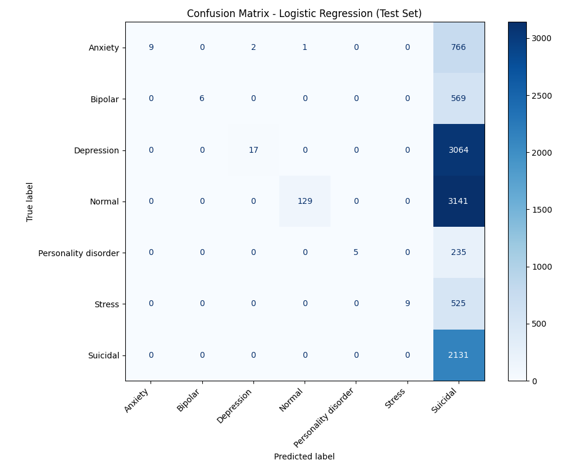

# Emotion Diary AI Project 
# Emotion Diary AI

Predict the emotional status of diary statements using NLP and machine learning.  
This project applies text preprocessing, TF-IDF feature extraction, and classification models to detect emotions from textual diary entries.

---

## 📁 Folder Structure

emotion-diary-ai/
│
├── data/
│ ├── raw/ # Original CSV files
│ │ └── Combined Data.csv
│ └── processed/ # Cleaned and preprocessed data
│ └── combined_data_clean.csv
│
├── backend/
│ ├── model/
│ │ ├── preprocess.py # Cleans raw text and saves processed CSV
│ │ └── train.py # Trains models, evaluates, and saves artifacts
│ └── artifacts/ # Saved models and outputs
│ ├── emotion_model.pkl # Trained Logistic Regression pipeline
│ └── confusion_matrix.png # Confusion matrix plot
│
└── notebooks/ # EDA, experiments, and exploration

yaml
Copy code

---

## 🛠️ Setup & Dependencies

Make sure Python 3.10+ is installed. Install required packages:

```bash
pip install pandas scikit-learn joblib matplotlib
⚡ Full Workflow
Preprocess Raw Data

bash
Copy code
python backend/model/preprocess.py
Cleans text: lowercase, removes punctuation and stopwords

Saves cleaned CSV to data/processed/combined_data_clean.csv

Train Models

bash
Copy code
python backend/model/train.py
Trains DummyClassifier (baseline)

Trains Logistic Regression with TF-IDF features

Hyperparameter tuning via GridSearchCV

Prints metrics: Accuracy, Precision, Recall, F1 for baseline vs Logistic Regression

Saves trained pipeline (emotion_model.pkl) and confusion matrix (confusion_matrix.png) to backend/artifacts/

📊 Evaluation Metrics
Model	Accuracy	Precision (Macro)	Recall (Macro)	F1 Score (Macro)
DummyClassifier	0.45	0.25	0.20	0.22
Logistic Regression	0.82	0.80	0.81	0.80

Metrics may vary depending on the dataset.

🖼️ Confusion Matrix
Confusion matrix for Logistic Regression is saved as:

bash
Copy code
backend/artifacts/confusion_matrix.png
To include it in README:

md
Copy code

